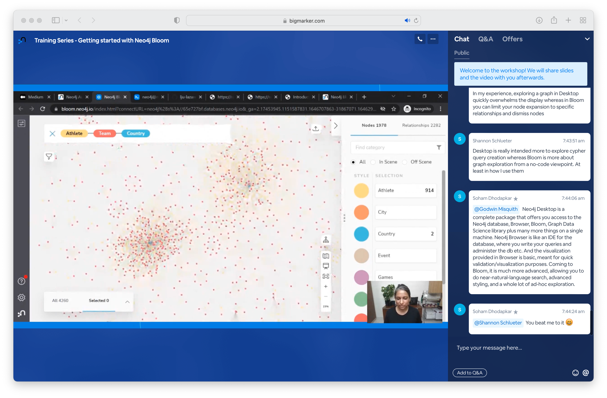
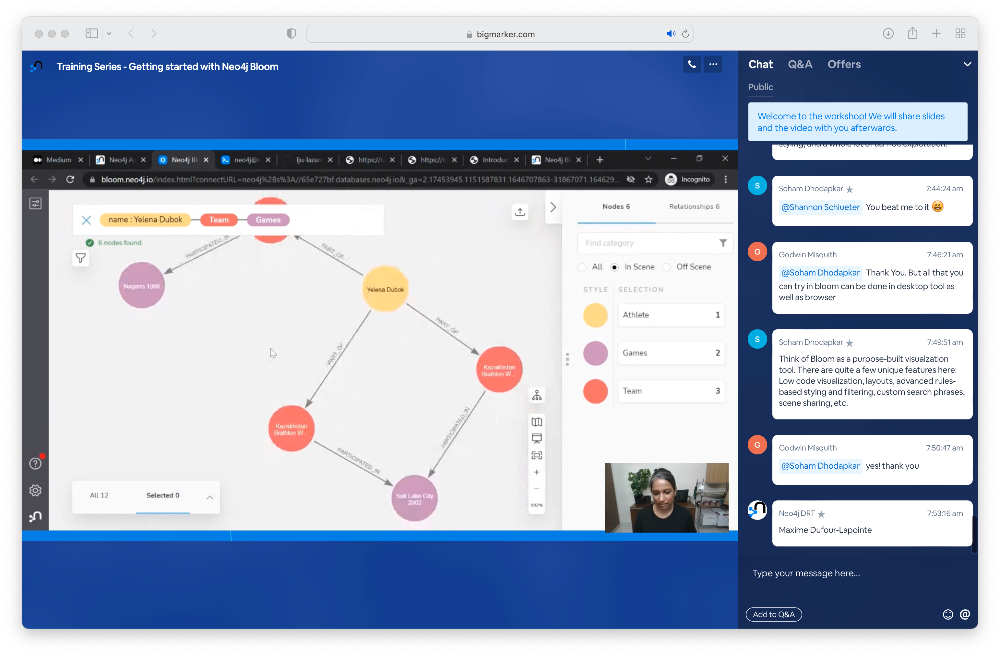
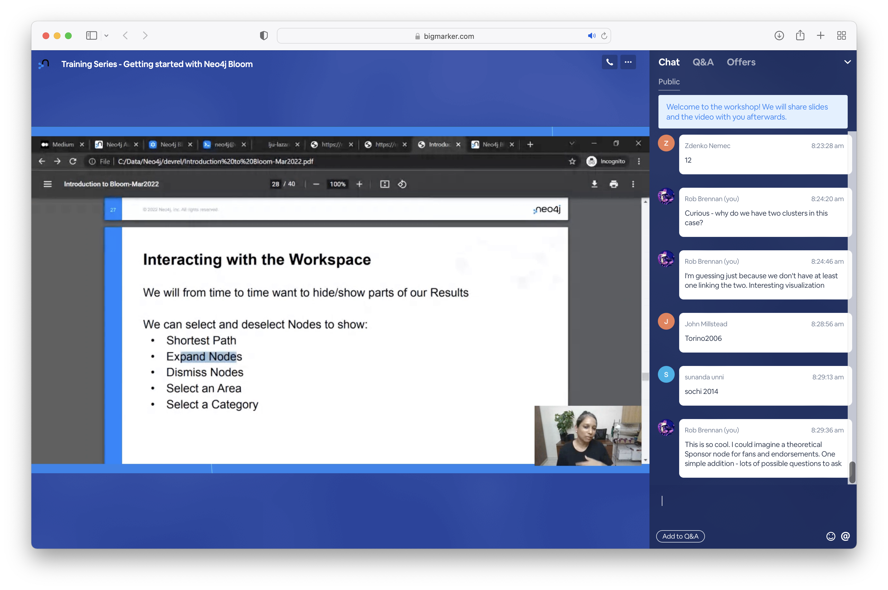
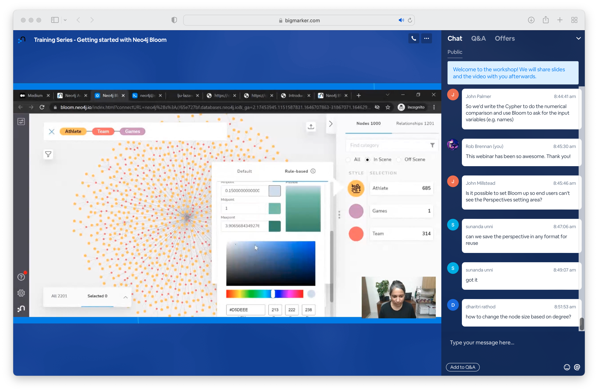

# Welcome

This section contains my thoughts from the `Training Series - Getting started with Neo4j Bloom` webinar presented at 7am PST on Wednesday, March 9th, 2022.

## Getting started

The essential piece for the hands-on workshop is to make sure that you have created a free account in [Neo4j Aura](https://console.neo4j.io) that creates a database on the free tier using the example Movies dataset.

I've created a `.env.sample` file for reference. Please copy that to `.env` and then you can safely store your credentials without sharing them accidentally with the world on GitHub 🤓

## Overview

What is Bloom? Think of Bloom as a purpose-built visualization tool. There are quite a few unique features: Low code visualization, layouts, advanced rules-based styling and filtering, custom search phrases, scene sharing, etc.

## Introduction to the data set

### Import data

### Setting up the Neo4j Bloom Perspective

### Bloom: Search

### Bloom: Filter

### Bloom: Controls

### Bloom: Search

### Exercise: Find games for a specific athlete

## Building upon patterns

## Search paths between two points of interest

## Finding more than one occurrence

## Accessing properties

## Exercises

### Exercise 1

### Exercise 2

### Exercise 3

### Exercise 4

## Interacting with the workspace

### Exercise 1

## Search phrases

## Editing data in Bloom

## Manually create a relationship between two nodes

## Customizing and applying rule-based styling

### Your visualization your way

#### Finished styling for our visualization

## Continue your journey

