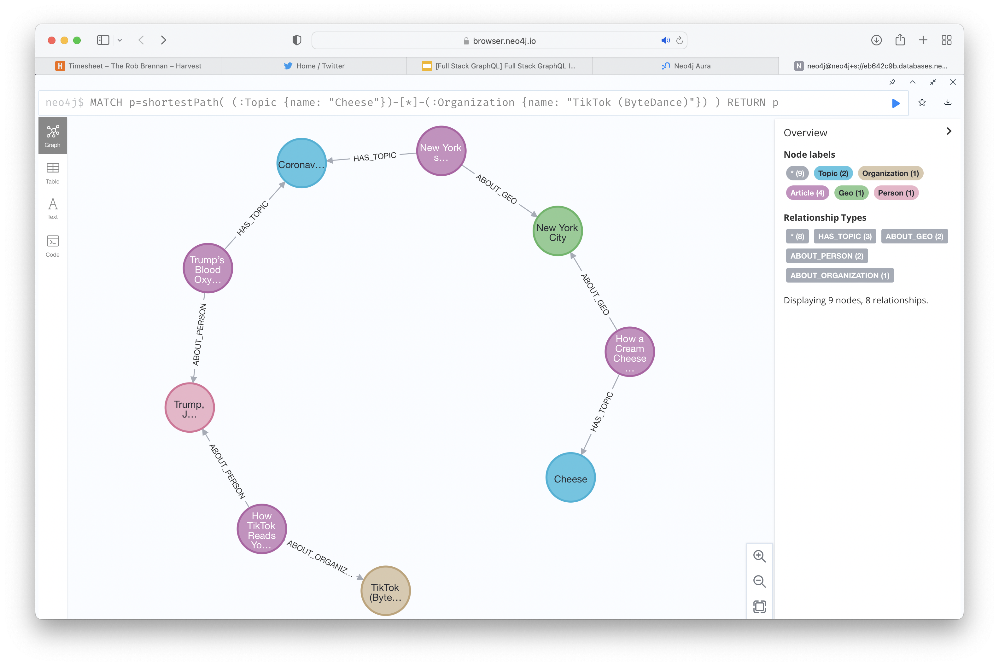

# Welcome

This section contains my thoughts from the `Training Series - Full Stack GraphQL In The Cloud` webinar presented at 8am PDT on Wednesday, March 16th, 2022.

## Getting started

The essential piece for the hands-on workshop is to make sure that you have created a free account in [Neo4j Aura](https://console.neo4j.io) that creates a database on the free tier using the example Movies dataset.

I've created a `.env.sample` file for reference. Please copy that to `.env` and then you can safely store your credentials without sharing them accidentally with the world on GitHub 🤓

## Let's go

### Neo4j Browser

Run `:play graph` after you have used Neo4j Browser to connect to your free Neo4j Aura instance.

We can take a peek at our sample JSON data by running:

```cypher
CALL apoc.load.json("https://raw.githubusercontent.com/johnymontana/fullstack-graphql-neo4j-auradb-nextjs-vercel-workshop/main/data/news.json") YIELD value
```

Import data and build our graph by processing each item in the `results` array:

```cypher
CALL apoc.load.json("https://raw.githubusercontent.com/johnymontana/fullstack-graphql-neo4j-auradb-nextjs-vercel-workshop/main/data/news.json") YIELD value
UNWIND value.results AS article
  MERGE (a:Article {url: article.url})
    SET a.title     = article.title,
        a.abstract  = article.abstract,
        a.published = datetime(article.published_date),
        a.byline    = article.byline

  FOREACH (desc IN article.des_facet |
    MERGE (d:Topic {name: desc})
    MERGE (a)-[:HAS_TOPIC]->(d)
  )

  FOREACH (per IN article.per_facet |
    MERGE (p:Person {name: per})
    MERGE (a)-[:ABOUT_PERSON]->(p)
  )

  FOREACH (org IN article.org_facet |
    MERGE (o:Organization {name: org})
    MERGE (a)-[:ABOUT_ORGANIZATION]->(o)
  )

  FOREACH (geo IN article.geo_facet |
    MERGE (g:Geo {name: geo})
    MERGE (a)-[:ABOUT_GEO]->(g)
  )

  MERGE (p:Photo {url: coalesce(article.media[0]["media-metadata"][2].url, "NA")})
    SET p.caption = article.media[0].caption
  MERGE (a)-[:HAS_PHOTO]->(p)

  WITH a, split(replace(substring(article.byline, 3), " and ", ","), ",") AS authors
  UNWIND authors AS author
    MERGE (auth:Author {name: trim(author)})
    MERGE (a)-[:BYLINE]->(auth)
RETURN *
```

Let's find all Articles in our graph:

```cypher
MATCH (a:Article) RETURN a
```

We can use ordering, sorting, and limiting in Cypher (pagination) to find the latest articles that were published:

```cypher
MATCH (a:Article)
RETURN a
ORDER BY a.published DESC
LIMIT 10
```

We can define more complex graph patterns. Let’s also include topics of articles:

```cypher
MATCH (a:Article)-[:HAS_TOPIC]->(t:Topic)
RETURN *
ORDER BY a.published DESC
LIMIT 25
```

Cypher pattern matching allows us to define complex graph patterns to search for in the graph:

```cypher
MATCH (a:Article)-[:HAS_TOPIC]->(t:Topic)
RETURN *
ORDER BY a.published DESC
LIMIT 25
```

Cypher has a number of features built for working with graph data. Here we look at variable length paths and find the shortest path between two nodes in the graph.

What’s the shortest path from "Cheese" to "Social Media"?

```cypher
MATCH
p=shortestPath(
    (:Topic {name: "Cheese"})-[*]-(:Organization {name: "TikTok (ByteDance)"})
)
RETURN p
```



## Resources

Slide deck - [https://docs.google.com/presentation/d/1DpEDMPFnRlE-vz1YmZ2fGtXfhr9Omd4CAIZ2qQeVCic/edit#slide=id.gc60ddbe1fe_0_121](https://docs.google.com/presentation/d/1DpEDMPFnRlE-vz1YmZ2fGtXfhr9Omd4CAIZ2qQeVCic/edit#slide=id.gc60ddbe1fe_0_121)
