# Welcome

This section contains my thoughts from the `Training Series - Intro to Neo4j` webinar presented at 7am PST on Wednesday, March 2nd, 2022.

## Getting started

The first part of this webinar covered an excellent overview of some example graphs and use cases.

Let's take a look at an example that processes a bunch of documents and files to generate a graph to investigate the Paradise Papers by the International Consortium of Investigative Journalists (ICIJ):

The essential piece for the hands-on workshop is to make sure that you have created a free account in [Neo4j Aura](https://console.neo4j.io) that creates a database on the free tier using the example Movies dataset.

I've created a `.env.sample` file for reference. Please copy that to `.env` and then you can safely store your credentials without sharing them accidentally with the world on GitHub 🤓

## Identifying good graph scenarios

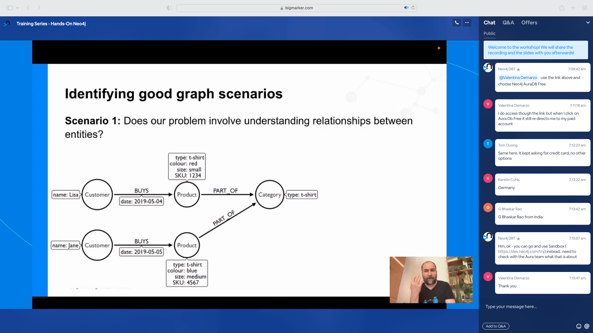

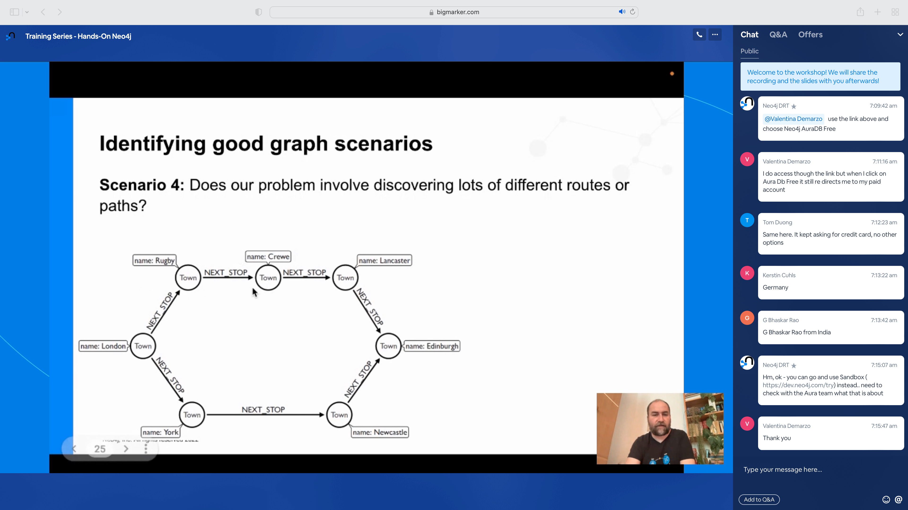

## Property graph database

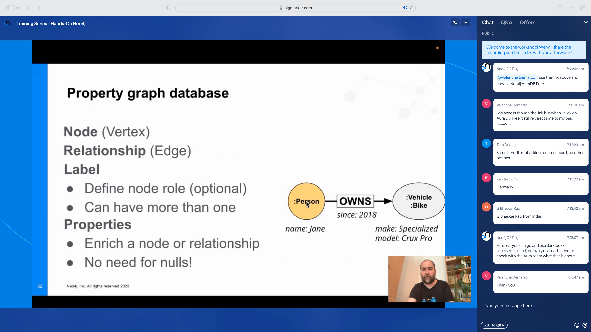

## Querying the graph

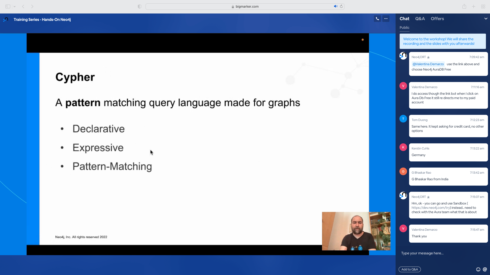

Quick reference - you can find the latest Neo4j reference card for Cypher at [http://dev.neo4j.com/refcard](http://dev.neo4j.com/refcard)

## Use the Aura Movies database you created

Connect to your database using Neo4j Browser and start querying. 🤓

Example query
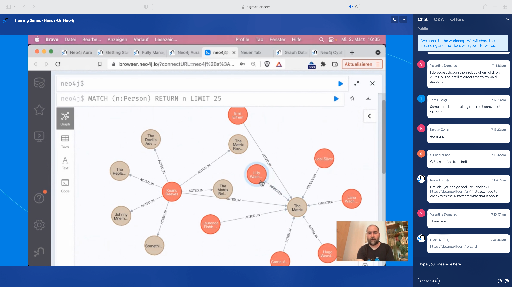

Visualize the graph database schema

Zoom out to view results from the query

### Queries

Find all nodes with a `Movie` label

Table view

Query for movie title and release year

Query all `Movie` and `Person` nodes - no relationship

Display nodes with any relationship between a `Person` and a `Movie`
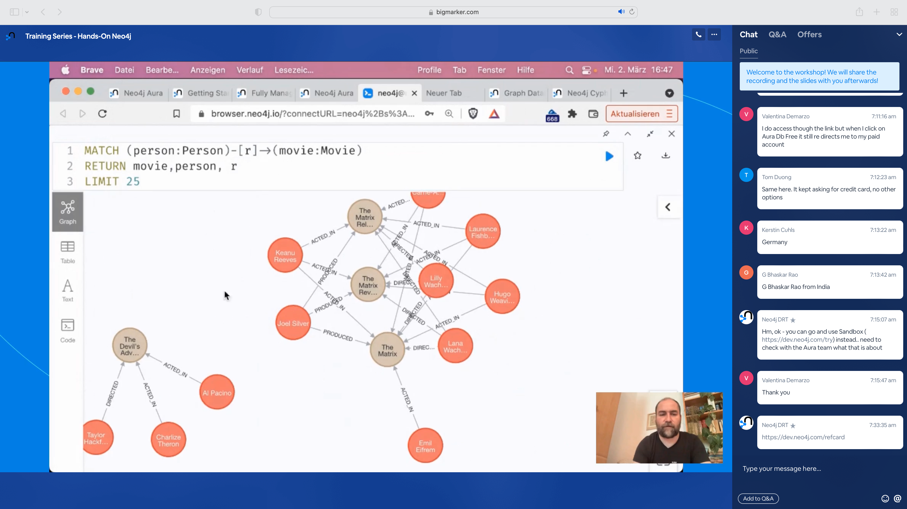

Let's find all the people that have `ACTED_IN` a `Movie`

What about building upon the previous query to find all the people who acted in those same movies AND the other actors? Easy.
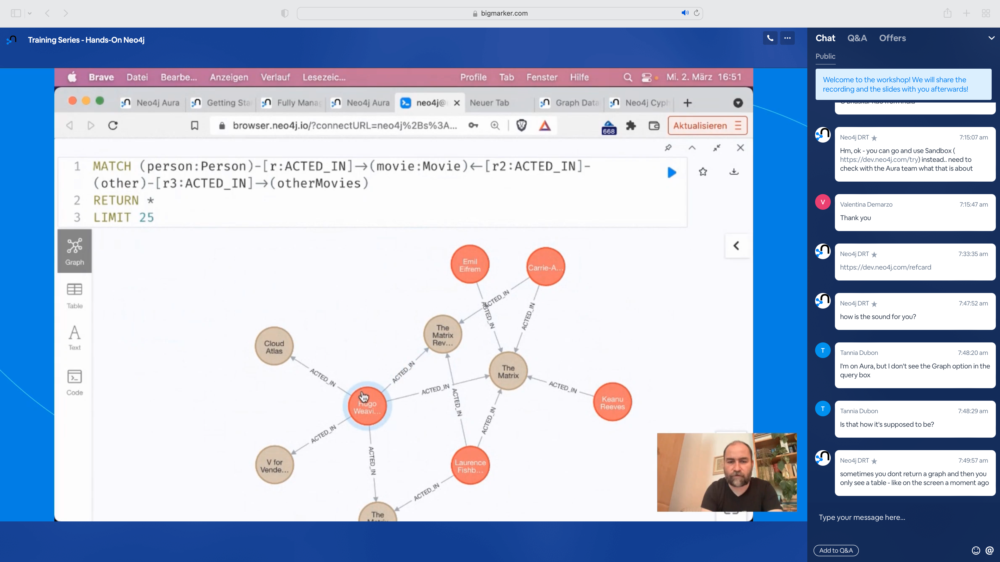

Query for specific actors
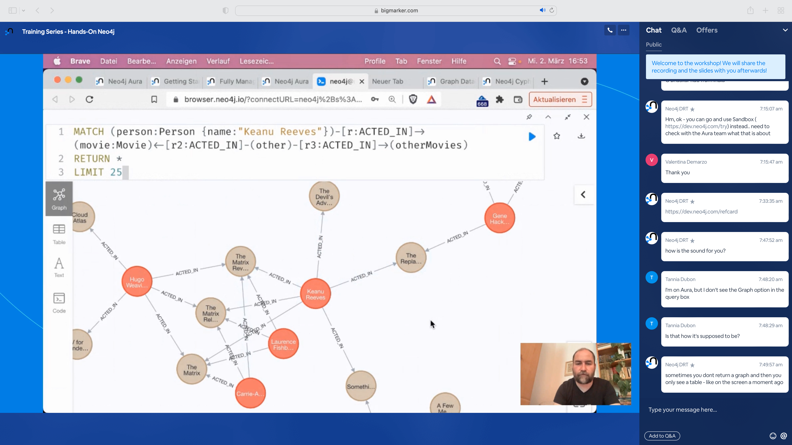

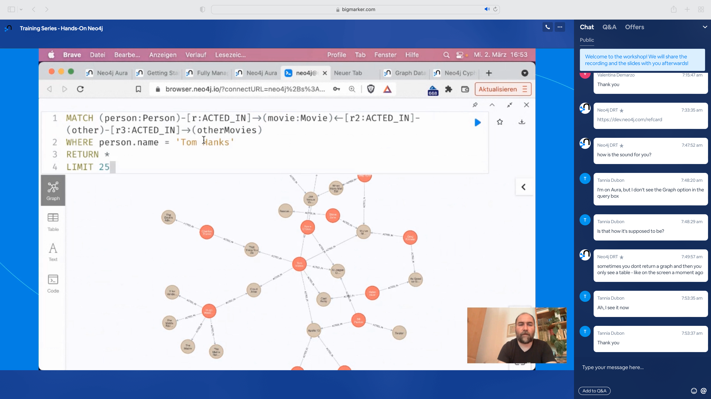
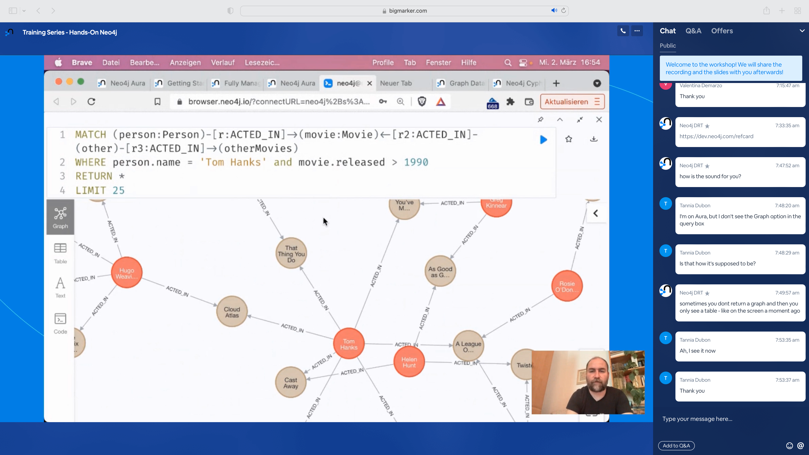

Let's have fun with the movies Tom Hanks `ACTED_IN` and return some results.

What about finding the top 3 people in our movies dataset?

Example using `path`

#### The Kevin Bacon problem

Find people three hops away from Kevin Bacon

Find people five hops away from Kevin Bacon

Find the shortest path between Kevin Bacon and Meg Ryan

Find all the shortest paths between Kevin Bacon and Meg Ryan

Find the top three shortest paths between Kevin Bacon and Meg Ryan

### What about deleting records that match a pattern?

### Creating data and relationships

Cypher does offer a `CREATE` statement that will create data and relationships. However, it will constantly create and recreate to your heart's content. Use `MERGE` to upsert data instead.

Find a specific person and movie that we want to create a relationship between

Create a relationship between a specific person and movie using Cypher

## Web-based Data Importer tool from Neo4j

This is a great tool available at [https://data-importer.neo4j.io](https://data-importer.neo4j.io)
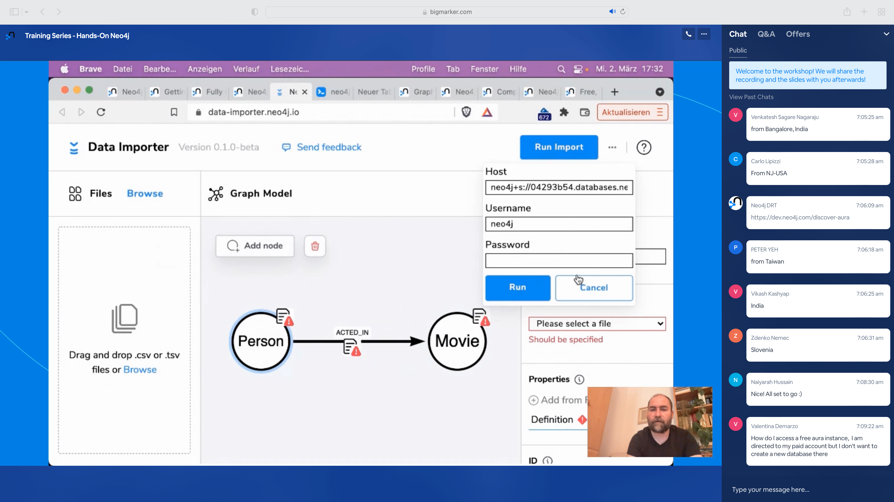

## EXAMPLE: Import Stack Overflow data into Neo4j

Let's see how we can use Neo4j to import and explore some data from Stack Overflow.

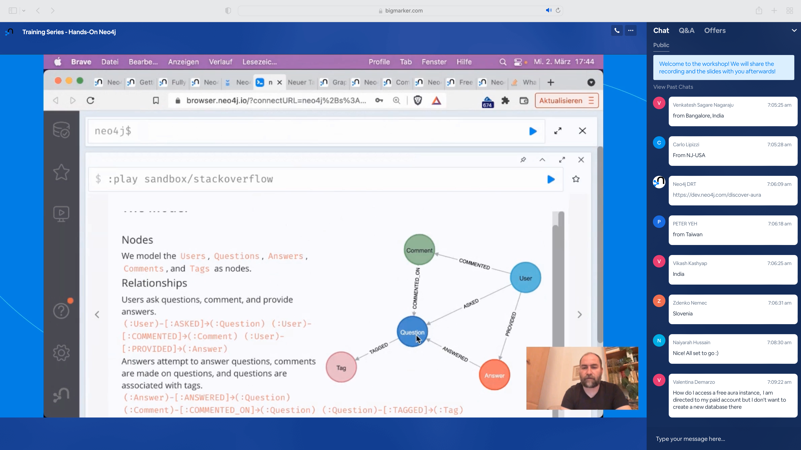

## What else is there?

